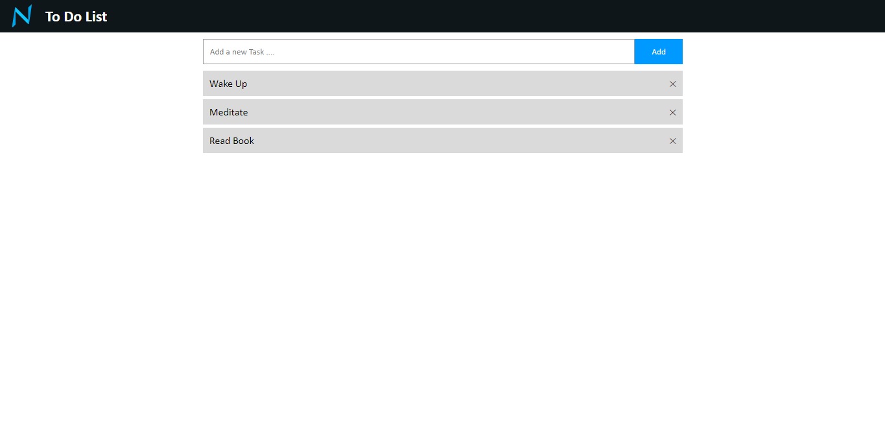

# Todolist App in Nijor

This repository contains an example todolist app written in Nijor. <br>
You can browse through it's code to learn Nijor. <br>

Clone this Repo :
```
git clone https://github.com/nijorjs/todolist-example todolist
```
Get inside tge todolist directory :
```
cd todolist
```
Compile the project :
```
nijor compile
```
Start the Nijor server :
```
nijor serve
```